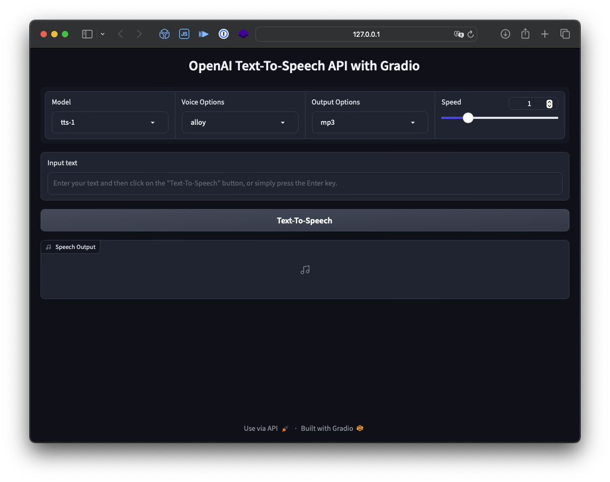

# OpenAI Text To Speech API with Gradio

## Start up Flow

1. copy `.env.example` to named file `.env`
2. put your openai api key in `.env` value `OPENAI_KEY`
3. type `virtualenv venv` to create new venv
4. type `source venv/bin/activate` to activity venv
5. type `pip install -r requirements.txt` to install requirements package
6. wait pip install finish
7. type `python app.py`
8. open your browser and type [http://127.0.0.1:7860](http://127.0.0.1:7860)
9. the api docs in [http://127.0.0.1:7860/?view=api](http://127.0.0.1:7860/?view=api)

## Docker Container Build

To build a Docker container for the OpenAI Text To Speech API with Gradio, follow these steps:

1. Make sure you have Docker installed on your system.
2. Open a terminal and navigate to the project directory.
3. Run the following command to build the Docker image:
    ```
    docker build -t openai-tts-gradio .
    ```
4. Wait for the build process to complete.
5. Once the build is finished, you can run the Docker container using the following command:
    ```
    docker run -d --name openai-tts-gradio -p 7860:7860 -e OPENAI_KEY=<YOUR_OPENAI_KEY> -e SERVER_NAME=0.0.0.0 openai-tts-gradio
    ```
6. Open your browser and navigate to [http://127.0.0.1:7860](http://127.0.0.1:7860) to access the API.


interface like this
